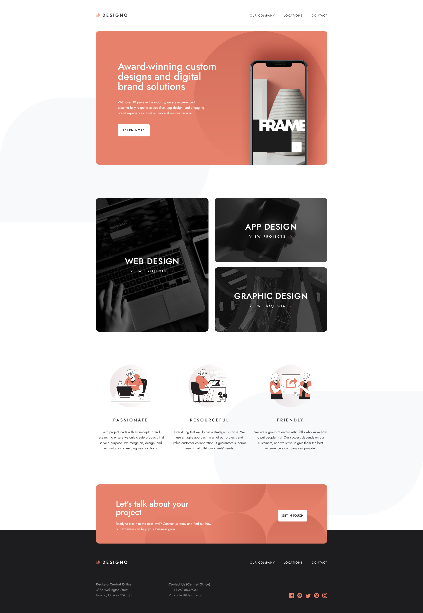

# Frontend Mentor - Designo agency website solution

This is a solution to the [Designo agency website challenge on Frontend Mentor](https://www.frontendmentor.io/challenges/designo-multipage-website-G48K6rfUT).

## Table of contents

- [Overview](#overview)
  - [The challenge](#the-challenge)
  - [Screenshot](#screenshot)
  - [Links](#links)
- [My process](#my-process)
  - [Built with](#built-with)
  - [What I learned or practiced](#what-i-learned)
  - [Continued development](#continued-development)

## Overview

### The challenge

Users should be able to:

- View the optimal layout for each page depending on their device's screen size
- See hover states for all interactive elements throughout the site
- Receive an error message when the contact form is submitted if:
  - The `Name`, `Email Address` or `Your Message` fields are empty should show "Can't be empty"
  - The `Email Address` is not formatted correctly should show "Please use a valid email address"
- **Bonus**: View actual locations on the locations page maps (we recommend [Leaflet JS](https://leafletjs.com/) for this)

### Screenshot



### Links

- Live Site URL: (https://designo-multi-page-website-64.netlify.app/)

## My process

### Built with

- HTML
- CSS
- JavaScript
- [React](https://reactjs.org/)
- [Tailwind](https://tailwindcss.com/)
- [TypeScript](https://www.typescriptlang.org/)

### What I learned or practiced

- Using HTML, CSS, JavaScript, React, Tailwind and TypeScript
- Responsiveness & Accessibility
- Using CSS Grid
- Using custom Tailwind
- Using a class function to apply both styling and active styling to a NavLink
- Dynamically applying background images for different screen sizes using inline styling, CSS variables and media queries
- Improving visiblity for focus outlines/rings on certain elements
- Properly rounding Links that wrap containers
- Handling outside clicks for a hamburger menu
- Adding a darkened screen effect when the hamburger menu is open
- Automatically closing the hamburger menu and removing the darkened screen effect if the screen size changes
- Automatically scrolling to the top of the page on route change
- Automatically scrolling to a certain part of the page on route change after clicking a button
- Positioning background images
- Using z-indexing to stack elements
- Creating mock data to use in iterative component rendering
- Setting up bulk image imports
- Refactoring repeated code into components
- Form input styling
- Handling and styling custom form validation error messages
- Temporarily rendering a form submission confirmation message
- Basic use of Leaflet.js
- Handling website width on larger screen sizes properly

Some code snippets:
```js
<div 
    className="project-category-card flex flex-col justify-center items-center gap-y-3 h-62.5 md:h-50 2xl:h-full px-14 text-white text-center uppercase bg-cover bg-center rounded-2xl" 
    style={{
        "--mobile-bg": `url(${images.mobile})`,
        "--tablet-bg": `url(${images.tablet})`,
        "--desktop-bg": `url(${images.desktop})`,
    } as React.CSSProperties}
  >
```
```js
useEffect( () => {
    function handleClickOutside(event: MouseEvent) {
        if (
            menuRef.current 
            && !menuRef.current.contains(event.target as Node) 
            && buttonRef.current
            && !buttonRef.current.contains(event.target as Node)
        ) {
            setMenuOpen(false)
        }
    }
    
    if (menuOpen) {
        document.addEventListener("mousedown", handleClickOutside)
    }
    
    return () => {
        document.removeEventListener("mousedown", handleClickOutside)
    }
}, [menuOpen])
```
```js
useEffect( () => {
    const mediaQuery = window.matchMedia("(min-width: 768px)")

    function handleScreenChange(event: MediaQueryListEvent) {
        if (event.matches) {
            setMenuOpen(false)
        }
    }

    mediaQuery.addEventListener("change", handleScreenChange)

    return () => {
        mediaQuery.removeEventListener("change", handleScreenChange)
    }
}, [])
```

### Continued development

- Handling rem units more efficiently with custom Tailwind font-size classes
- Positioning background images
- Using z-indexing to stack elements